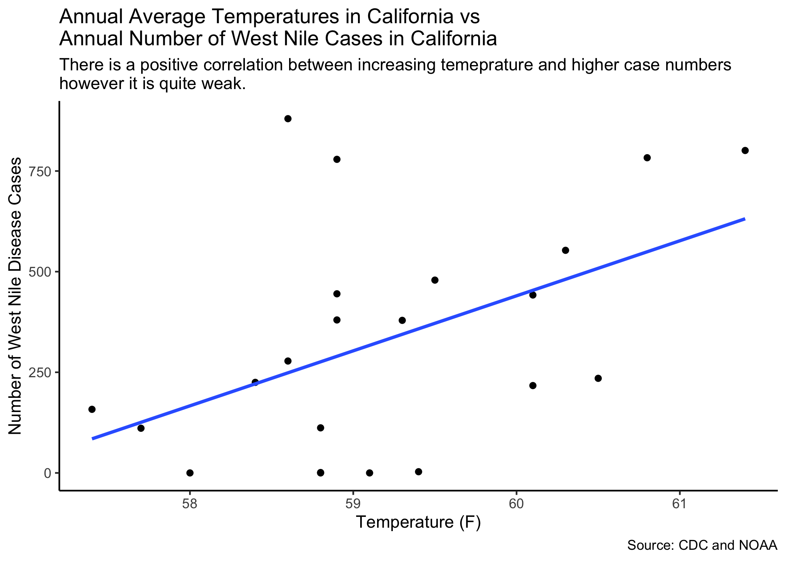
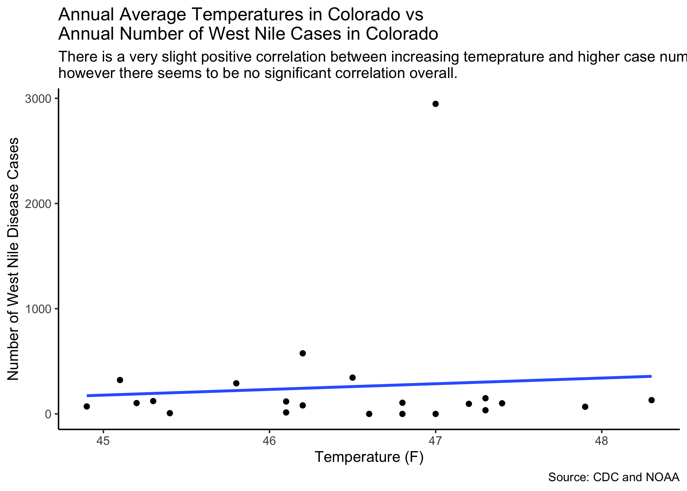
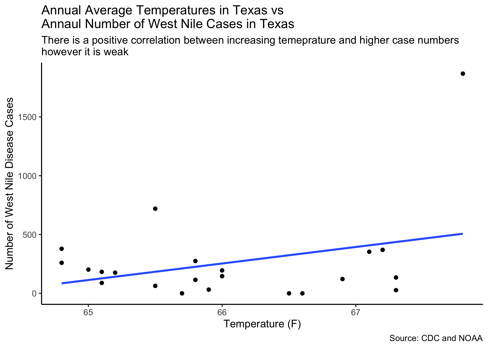
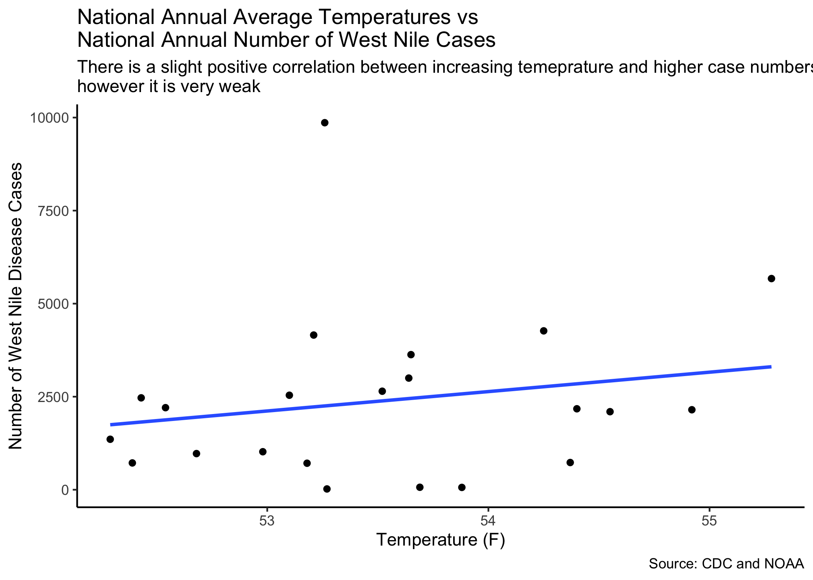

```{r setup, include=FALSE}
knitr::opts_chunk$set(echo = TRUE)
library(tidyverse)
library(ggplot2)
library(ggthemes)
library(readxl)
library(dbplyr)
library(janitor)
library(data.table)
library(usethis)
library(distill)
library(knitr)
```

```{r echo=FALSE}
#Setting up the Data

WN<-read_xlsx(path="WestNile.xlsx",
           sheet=1,) |> 
  clean_names() |>
  filter(state%in%c("National","California","Texas","Colorado","Nebraska","Illinois"))

Temp<-read_xlsx(path="WestNile.xlsx",
           sheet=3) |> 
  clean_names() |> 
  filter(state%in%c("National","California","Texas","Colorado","Nebraska","Illinois"))

WNdf<-as.data.frame(t(WN)) |>
  slice(2:24)
Tempdf<-as.data.frame(t(Temp)) |> 
  slice(2:24)
colnames(WNdf)<-c("California","Colorado","Illinois","Nebraska","Texas","National")
colnames(Tempdf)<-c("California","Colorado","Illinois","Nebraska","Texas","National")

#WN
#Temp
#WNdf
#Tempdf
```

```{r echo=FALSE}
#Cleaning the Data

data<-full_join(WN,Temp,by = c("state", "x1999", "x2000", "x2001", "x2002", "x2003", "x2004", "x2005", "x2006", "x2007", "x2008", "x2009", "x2010", "x2011",
"x2012", "x2013", "x2014", "x2015", "x2016", "x2017", "x2018", "x2019", "x2020"))
clean_data<-transpose(data) |> 
  slice(2:24) |> 
  mutate("Year"=c(1999,2000,2001,2002,2003,2004,2005,2006,2007,2008,2009,2010,2011,2012,2013,2014,2015,
                  2016,2017,2018,2019,2020,"Total"))

colnames(clean_data)<-c("California","Colorado","Illinois","Nebraska","Texas","National",
                        "CaliforniaT","ColoradoT","IllinoisT","NebraskaT","TexasT",
                        "NationalT","Year")
clean_data$California<-as.double(clean_data$California)
clean_data$Colorado<-as.double(clean_data$Colorado)
clean_data$Illinois<-as.double(clean_data$Illinois)
clean_data$Nebraska<-as.double(clean_data$Nebraska)
clean_data$Texas<-as.double(clean_data$Texas)
clean_data$National<-as.double(clean_data$National)
clean_data$`CaliforniaT`<-as.double(clean_data$`CaliforniaT`)
clean_data$`ColoradoT`<-as.double(clean_data$`ColoradoT`)
clean_data$`IllinoisT`<-as.double(clean_data$`IllinoisT`)
clean_data$`NebraskaT`<-as.double(clean_data$`NebraskaT`)
clean_data$`TexasT`<-as.double(clean_data$`TexasT`)
clean_data$`NationalT`<-as.double(clean_data$`NationalT`)

#clean_data[,c(13,1,2,3,4,5,6,7,8,9,10,11,12)] 
```

```{r echo=FALSE}
#California Plot

CalWN<-clean_data |>  
  filter(Year!="Total") |> 
  ggplot(aes(x=CaliforniaT,y=California))+
  geom_point()+
  geom_smooth(method="lm",
              formula=y~x,
              se=FALSE)+
  theme_classic()+
  labs(title="Annual Average Temperatures in California vs \nAnnual Number of West Nile Cases in California",
       subtitle="There is a positive correlation between increasing temeprature and higher case numbers\nhowever it is quite weak.",
       x="Temperature (F)",
       y="Number of West Nile Disease Cases",
       caption="Source: CDC and NOAA")

#ggsave("CalWN.png",plot=CalWN)
```

```{r echo=FALSE}
#Colorado Plot

ColWN<-clean_data |>  
  filter(Year!="Total") |> 
  ggplot(aes(x=ColoradoT,y=Colorado))+
  geom_point()+
  geom_smooth(method="lm",
              formula=y~x,
              se=FALSE)+
  theme_classic()+
  labs(title="Annual Average Temperatures in Colorado vs \nAnnual Number of West Nile Cases in Colorado",
       subtitle="There is a very slight positive correlation between increasing temeprature and higher case numbers\nhowever there seems to be no significant correlation overall.",
       x="Temperature (F)",
       y="Number of West Nile Disease Cases",
       caption="Source: CDC and NOAA")

#ggsave("ColWN.png",plot=ColWN)
```

```{r echo=FALSE}
#Texas Plot

TexWN<-clean_data |>  
  filter(Year!="Total") |> 
  ggplot(aes(x=TexasT,y=Texas))+
  geom_point()+
  geom_smooth(method="lm",
              formula=y~x,
              se=FALSE)+
  theme_classic()+
  labs(title="Annual Average Temperatures in Texas vs \nAnnaul Number of West Nile Cases in Texas",
       subtitle="There is a positive correlation between increasing temeprature and higher case numbers\nhowever it is weak",
       x="Temperature (F)",
       y="Number of West Nile Disease Cases",
       caption="Source: CDC and NOAA")

#ggsave("TexWN.png",plot=TexWN)
```

```{r echo=FALSE}
#National Plot

NatWN<-clean_data |>  
  filter(Year!="Total") |> 
  ggplot(aes(x=NationalT,y=National))+
  geom_point()+
  geom_smooth(method="lm",
              formula=y~x,
              se=FALSE)+
  theme_classic()+
  labs(title="National Annual Average Temperatures vs \nNational Annual Number of West Nile Cases",
       subtitle="There is a slight positive correlation between increasing temeprature and higher case numbers\nhowever it is very weak",
       x="Temperature (F)",
       y="Number of West Nile Disease Cases",
       caption="Source: CDC and NOAA")

#ggsave("NatWN.png",plot=NatWN)
```
## Introduction

As stated on the home page, higher temperatures would be expected to cause a higher number of West Nile disease cases as they allow mosquitoes to become more prevalent. However, this is not supported by the trends shown in the graphs below.

The graphs below use average annual temperature data collected by the National Oceanic and Atmospheric Administration against the annual number of West Nile disease cases. The CDC contained West Nile Disease data from 1999 to 2020, meaning only these years were considered. The annual temperature and case numbers were compared in the states of California, Colorado and Texas as they had the top three highest number of West Nile cases. A comparison between the national annual temperature the national annual number of West Nile cases was also made in a final, fourth graph. Through these graphs we can see that the relationship between temperature and West Nile cases is not as simplistic as it is on paper!

```{r fig.align="center"}
#Images





```
